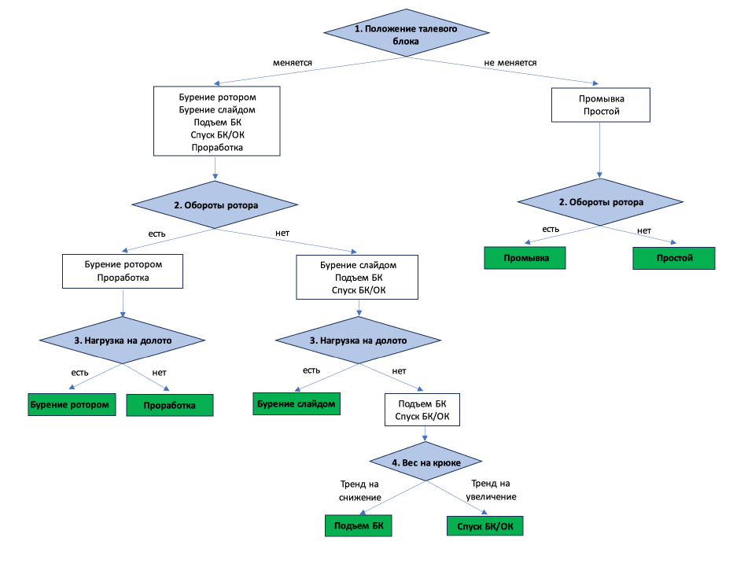

# Подготовка проекта:

Cоздать и активировать виртуальное окружение:

```
python3 -m venv venv
```

```
source venv/bin/activate
```

Установить зависимости из файла requirements.txt:

```
python3 -m pip install --upgrade pip
```

```
pip install -r requirements.txt
```

# Описание проекта:

Python скрипт выполняет анализ и обработку данных каротажа из файла LAS. Скрипт включает в себя очистку данных, удаление выбросов и алгоритм определения текущей операции на основе различных критериев.
Функция рассчитывает и интерпретирует различные операционные параметры (как положение блока, обороты ротора и нагрузку на крюк), чтобы определить тип операции в указанное временное окно.



# Некоторые функции проекта:

1. file_path: Указывает расположение файла LAS для чтения.
2. lasio.read: Загружает файл LAS.
3. las.df(): Преобразует данные файла LAS в DataFrame pandas.
4. pd.to_datetime: Преобразует индекс DataFrame в формат даты и времени, предполагая, что временные метки находятся в миллисекундах.
5. quantile: Рассчитывает первый и третий квартили.
6. iqr: Межквартильный размах, используемый для определения границ, что считается выбросом.
7. dataframe_cleaned: DataFrame после удаления выбросов.
8. interpolate(): Заполняет значения NaN в DataFrame, которые могут появиться после удаления выбросов.
9. df_positive.head(): Выводит первые несколько строк DataFrame после очистки и интерполяции.